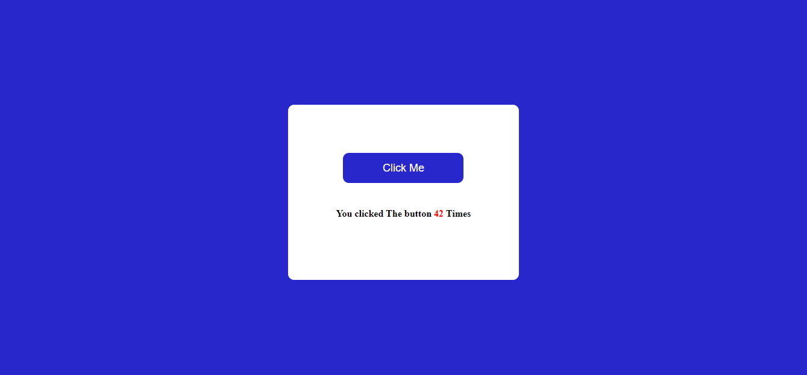

# PRANAV MATHUR

## Learnings from the project:

- DOM methods to fetch HTML elements like _getElementById_

## Time taken:

    It took me 15 minutes to complete this project.

## Screenshots:

## Live link:

[Go to site](https://07-click-the-button.netlify.app/)
